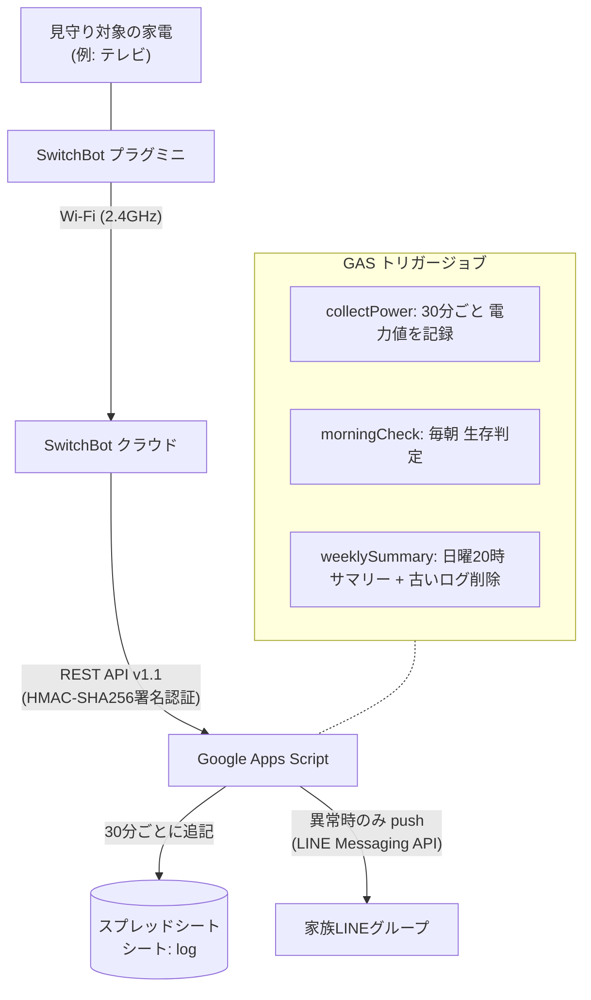

# mimamori — 高齢家族見守りシステム

**本人が毎日必ず使う家電**（テレビなど）に挟んだ SwitchBot プラグミニの電力値を Google Apps Script（GAS）で30分ごとに記録し、**「朝、その家電を使った形跡がない」ときだけ** LINEの家族グループにアラートを送る、デッドマンスイッチ型の見守りシステムです。カメラは使いません。月間コストは0円で運用できます（LINE無料枠・GAS・スプレッドシートの範囲内）。

## 設計思想

### なぜカメラではなくスマートプラグか

カメラでの見守りは「監視されている」という心理的負担を本人に強います。このシステムは**家電の消費電力**という間接的なシグナルだけを見るため、生活の中身には一切踏み込みません。本人には「電気の使いすぎを見る小さい機械」程度の説明で受け入れてもらいやすく、プライバシーと見守りを両立できます。

### シグナルは本人の生活スタイルから選ぶ

**このシステムの精度は、コードよりも「どの家電を見るか」でほぼ決まります。** ここが設計の中心です。

「高齢者だから電気ポット」といった一般論で選ぶと失敗します。ポットを毎日使う人もいれば、使わない人もいます。同じ人でも夏は麦茶に切り替えて使わなくなります。使わない日にアラートが鳴れば、家族は数週間で通知を読み飛ばすようになり、本命のアラートが埋もれます。

見守り対象の家電は、次の3条件を満たすものを**本人の生活を観察して**選んでください。

1. **毎日必ず使う** — 週に何度か、では判定が成立しません
2. **季節や天候に左右されない** — 夏だけ／冬だけ使う家電は不適です
3. **使わないこと自体が異常のサインになる** — 「使わない日もある」家電では誤検知が避けられません

向かない家電と、その理由は次の通りです。

| 家電 | 向かない理由 |
|---|---|
| 冷蔵庫 | 24時間通電しているため、生活のシグナルになりません |
| エアコン・こたつ・扇風機 | 季節依存。使わない時期は判定そのものが成立しません |
| 照明 | 日照時間で点灯タイミングが変わり、朝の判定に使いにくいです |
| 電気ポット | 夏に使わなくなりがちで、稼働時間が短くポーリングで取りこぼします（後述） |

このリポジトリの運用例では、祖母が**テレビを毎日必ずつける**生活だったため、テレビを見守り対象にしています。「その家にとっての正解」はその家の生活の中にしかありません。

### 家電のタイプで判定の設計が変わる

電力値は30分ごとのポーリングで取得します。そのため**家電の稼働時間の長さ**が、判定の確実性に直結します。

| タイプ | 例 | しきい値の目安 | 30分間隔での適性 |
|---|---|---|---|
| **長時間・中電力** | テレビ、ラジオ | 待機電力と使用時電力の中間。テレビなら待機0.5W／使用60W前後なので **20W** | **◎ 推奨** |
| **短時間・高電力** | 電気ポット、電子レンジ、ドライヤー | 稼働時の電力より低く。ポットなら沸騰700〜1000Wに対して **500W** | △ 非推奨 |

短時間・高電力の家電が非推奨なのは、**稼働が短すぎてポーリングに引っかからない**からです。電気ポットの沸騰は5分程度なので、30分ごとの観測が沸騰中に当たる確率は1〜2割しかありません。元気にお茶を淹れていても「使用形跡なし」と判定されうる、という構造的な弱点があります。

どうしてもこのタイプを使う場合は、`collectPower` のトリガー間隔を**10分ごと**に詰めてください（GASの無料枠には十分収まります）。それでも取りこぼしのリスクは残ります。

一方テレビのように数時間連続で稼働する家電なら、朝の視聴中に必ず何度も観測に引っかかるため、原理的に取りこぼしが起きません。

### 通知は異常時のみ

「今日も元気です」通知が毎日届くと、家族は数週間で読み飛ばすようになり、本当のアラートも埋もれます（アラート疲れ）。このシステムは**正常時は沈黙**し、通知するのは次の3つだけです。

1. **見守りアラート**: 朝の判定時刻までに対象家電の使用形跡がない（本命の通知）
2. **システム異常**: 当日のデータが1件も記録されていない（回線断・停電・GAS障害の疑い）
3. **週次サマリー**: 日曜20時に1通だけ。「システム自体が生きていること」を家族が確認するための死活監視を兼ねる

## アーキテクチャ



詳細な構成図・シーケンス図は [docs/architecture.md](docs/architecture.md) を参照してください。

## セットアップ概要

手を動かす詳細手順は **[docs/setup-guide.md](docs/setup-guide.md)** にまとまっています。全体の流れは次の通りです。

1. **見守り対象の家電を決める**: 上記「シグナルは本人の生活スタイルから選ぶ」の3条件で選定
2. **プラグ設置**: 対象家電にプラグミニを挟み、SwitchBotアプリでWi-Fi接続
3. **SwitchBot APIトークン取得**: アプリの開発者向けオプションからトークンとシークレットを控える
4. **LINE公式アカウント作成**: Messaging APIチャネルを作り、「グループ参加を許可」をONにしてチャネルアクセストークンを発行
5. **GASプロジェクト作成**: スプレッドシートに `log` シートを用意し、本リポジトリのコードをデプロイ（下記）。スクリプトプロパティにトークン類を登録
6. **groupId取得**: WebアプリとしてデプロイしてLINEのWebhookに設定し、botをグループに招待して `doPost` のログから `groupId` を取得
7. **観察期間（1〜2週間）**: `collectPower` だけを回してしきい値と判定時刻を実測で決める（下記）
8. **本運用開始**: `morningCheck` / `weeklySummary` のトリガーを追加

### 観察期間 — しきい値と判定時刻を実測で決める

**いきなり全トリガーを登録して運用を始めないでください。** `POWER_THRESHOLD` と判定時刻は、机上の想定ではなく本人の実際の生活ログから決めます。ここを飛ばすと、誤検知でアラート疲れを起こすか、逆に異常を見逃します。

**STEP 1**: `collectPower` のトリガー（30分ごと）**だけ**を登録します。`morningCheck` はまだ登録しません。この段階では通知は一切飛びません。

**STEP 2**: 1〜2週間そのまま放置し、`log` シートに実データを溜めます。

**STEP 3**: 溜まったログから3つを読み取ります。

| 読み取るもの | 決まる設定 | 見方 |
|---|---|---|
| 使用時と待機時の `power_w` | `POWER_THRESHOLD` | 2つの値の中間に置く。待機電力の2〜3倍以上を目安に |
| 最も遅かった日の初回使用時刻 | `morningCheck` の判定時刻 | その時刻に**1時間の余裕**を足す |
| **1日も使わなかった日があるか** | （家電の選定そのもの） | あればその家電は不適格。別の家電を選び直す |

3つ目が最も重要です。**観察期間は、しきい値の決定だけでなく「その家電を選んだ判断が正しかったか」の検証も兼ねています。** 観察期間中に1日でも使わない日があれば、本運用でも同じ日が来て誤検知します。素直に家電を選び直してください。

**STEP 4**: 読み取った値をスクリプトプロパティに登録し、`morningCheck` / `weeklySummary` のトリガーを追加して本運用を開始します。

### スクリプトプロパティ

| プロパティ名 | 必須 | 内容 |
|---|---|---|
| `SWITCHBOT_TOKEN` | ✓ | SwitchBot APIトークン |
| `SWITCHBOT_SECRET` | ✓ | SwitchBot クライアントシークレット |
| `LINE_TOKEN` | ✓ | LINE チャネルアクセストークン（長期） |
| `LINE_GROUP_ID` | ✓ | 家族グループのgroupId（`doPost` のログで取得） |
| `PLUG_DEVICE_ID` | ✓ | プラグミニのdeviceId（`listDevices` の実行で取得） |
| `POWER_THRESHOLD` | ✓ | 使用判定しきい値（W）。**観察期間のログから決める**値のため、あえてデフォルト値を持ちません |
| `APPLIANCE_NAME` | | 通知文に出す家電名（例: `テレビ`）。省略時は `家電` |

`POWER_THRESHOLD` を必須にしているのは意図的です。デフォルト値があると「決めなくても動く」と誤読され、本人の生活に合っていないしきい値のまま静かに動き続けてしまいます。未設定ならジョブは明示的にエラーで止まります。

## clasp でのデプロイ手順

このスクリプトはスプレッドシートにバインドされた（コンテナバインド）GASプロジェクトとして動かします。スプレッドシートの「拡張機能 → Apps Script」で作成したプロジェクトの scriptId を使ってください。

```bash
# 1. clasp をインストール
npm i -g @google/clasp

# 2. Googleアカウントでログイン
clasp login

# 3. .clasp.json を作成（scriptId を自分のものに書き換える）
cp .clasp.json.example .clasp.json
#   → "scriptId": "YOUR_SCRIPT_ID" を実際のscriptIdに変更
#   （scriptIdはGASエディタの「プロジェクトの設定」で確認できる）

# 4. src/ 配下をGASへ反映
clasp push
```

`.clasp.json` は scriptId の実値を含むため `.gitignore` でコミット対象外にしています。

## トリガー設定

GASエディタの「トリガー」から時間主導型で登録します。**観察期間中は `collectPower` のみ**登録し、残り2件は本運用開始時に追加します。

| 関数 | 種類 | タイミング | 登録時期 |
|---|---|---|---|
| `collectPower` | 時間主導型 | 30分ごと（短時間稼働の家電なら10分ごと） | 観察期間から |
| `morningCheck` | 時間主導型・日付ベース | 毎日 午前10〜11時（**観察期間の結果で調整**） | 本運用開始時 |
| `weeklySummary` | 時間主導型・週ベース | 日曜 20〜21時 | 本運用開始時 |

`morningCheck` の時刻を変えたときは、通知文の時間帯表記は実行時刻から自動生成されるため、コードの修正は不要です。

## ファイル構成

```
src/
├── appsscript.json   # GASマニフェスト（Asia/Tokyo, V8）
├── config.gs         # スクリプトプロパティのアクセサと検証
├── switchbot.gs      # SwitchBot API v1.1（署名認証・リトライ・状態取得）
├── line.gs           # LINE push送信 / Webhook受信(groupId取得) / テスト送信
└── jobs.gs           # トリガージョブ3種（記録・朝の判定・週次サマリー）
```
