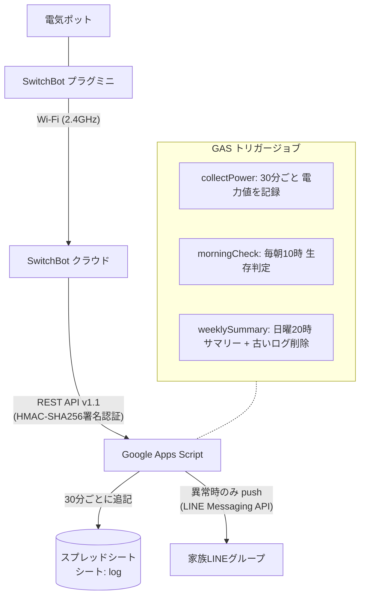

# mimamori — 高齢家族見守りシステム

電気ポットに挟んだ SwitchBot プラグミニの電力値を Google Apps Script（GAS）で30分ごとに記録し、**「朝10時までにポットを使った形跡がない」ときだけ** LINEの家族グループにアラートを送る、デッドマンスイッチ型の見守りシステムです。カメラは使いません。月間コストは0円で運用できます（LINE無料枠・GAS・スプレッドシートの範囲内）。

## 設計思想

### なぜカメラではなくスマートプラグか

カメラでの見守りは「監視されている」という心理的負担を本人に強います。このシステムは**毎日必ず使う家電（電気ポット）の消費電力**という間接的なシグナルだけを見るため、生活の中身には一切踏み込みません。本人には「電気の使いすぎを見る小さい機械」程度の説明で受け入れてもらいやすく、プライバシーと見守りを両立できます。

### 通知は異常時のみ

「今日も元気です」通知が毎日届くと、家族は数週間で読み飛ばすようになり、本当のアラートも埋もれます（アラート疲れ）。このシステムは**正常時は沈黙**し、通知するのは次の3つだけです。

1. **見守りアラート**: 朝10時までにポットの使用形跡がない（本命の通知）
2. **システム異常**: 当日のデータが1件も記録されていない（回線断・停電・GAS障害の疑い）
3. **週次サマリー**: 日曜20時に1通だけ。「システム自体が生きていること」を家族が確認するための死活監視を兼ねる

## アーキテクチャ



詳細な構成図・シーケンス図は [docs/architecture.md](docs/architecture.md) を参照してください。

## セットアップ概要

手を動かす詳細手順は **[docs/setup-guide.md](docs/setup-guide.md)** にまとまっています。全体の流れは次の通りです。

1. **プラグ設置**: 祖母宅の電気ポットにプラグミニを挟み、SwitchBotアプリでWi-Fi接続
2. **SwitchBot APIトークン取得**: アプリの開発者向けオプションからトークンとシークレットを控える
3. **LINE公式アカウント作成**: Messaging APIチャネルを作り、「グループ参加を許可」をONにしてチャネルアクセストークンを発行
4. **GASプロジェクト作成**: スプレッドシートに `log` シートを用意し、本リポジトリのコードをデプロイ（下記）。スクリプトプロパティにトークン類を登録
5. **groupId取得**: WebアプリとしてデプロイしてLINEのWebhookに設定し、botをグループに招待して `doPost` のログから `groupId` を取得
6. **トリガー設定**: 下表の3件を登録

### スクリプトプロパティ

| プロパティ名 | 内容 |
|---|---|
| `SWITCHBOT_TOKEN` | SwitchBot APIトークン |
| `SWITCHBOT_SECRET` | SwitchBot クライアントシークレット |
| `LINE_TOKEN` | LINE チャネルアクセストークン（長期） |
| `LINE_GROUP_ID` | 家族グループのgroupId（`doPost` のログで取得） |
| `PLUG_DEVICE_ID` | プラグミニのdeviceId（`listDevices` の実行で取得） |
| `POWER_THRESHOLD` | 使用判定しきい値（W）。省略時 500 |

## clasp でのデプロイ手順

このスクリプトはスプレッドシートにバインドされた（コンテナバインド）GASプロジェクトとして動かします。スプレッドシートの「拡張機能 → Apps Script」で作成したプロジェクトの scriptId を使ってください。

```bash
# 1. clasp をインストール
npm i -g @google/clasp

# 2. Googleアカウントでログイン
clasp login

# 3. .clasp.json を作成（scriptId を自分のものに書き換える）
cp .clasp.json.example .clasp.json
#   → "scriptId": "YOUR_SCRIPT_ID" を実際のscriptIdに変更
#   （scriptIdはGASエディタの「プロジェクトの設定」で確認できる）

# 4. src/ 配下をGASへ反映
clasp push
```

`.clasp.json` は scriptId の実値を含むため `.gitignore` でコミット対象外にしています。

## トリガー設定

GASエディタの「トリガー」から時間主導型で3件登録します。

| 関数 | 種類 | タイミング |
|---|---|---|
| `collectPower` | 時間主導型 | 30分ごと |
| `morningCheck` | 時間主導型・日付ベース | 毎日 午前10〜11時 |
| `weeklySummary` | 時間主導型・週ベース | 日曜 20〜21時 |

## ファイル構成

```
src/
├── appsscript.json   # GASマニフェスト（Asia/Tokyo, V8）
├── config.gs         # スクリプトプロパティのアクセサと検証
├── switchbot.gs      # SwitchBot API v1.1（署名認証・リトライ・状態取得）
├── line.gs           # LINE push送信 / Webhook受信(groupId取得) / テスト送信
└── jobs.gs           # トリガージョブ3種（記録・朝の判定・週次サマリー）
```
