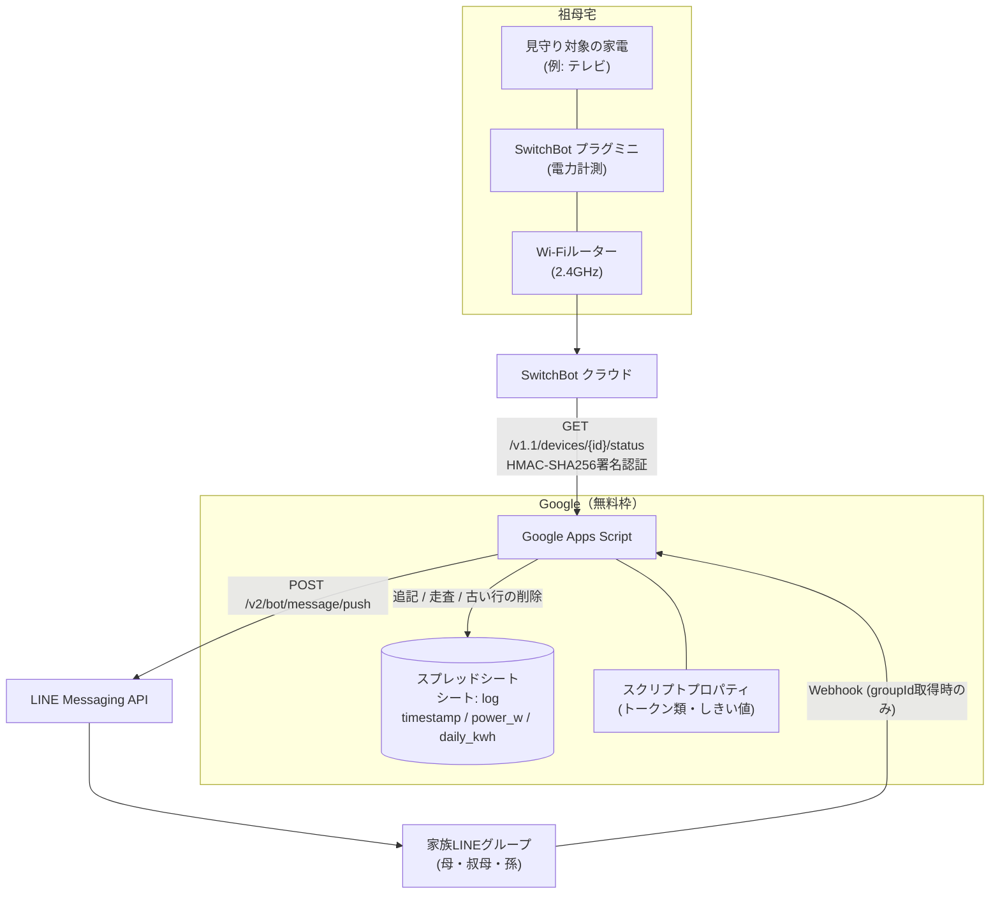
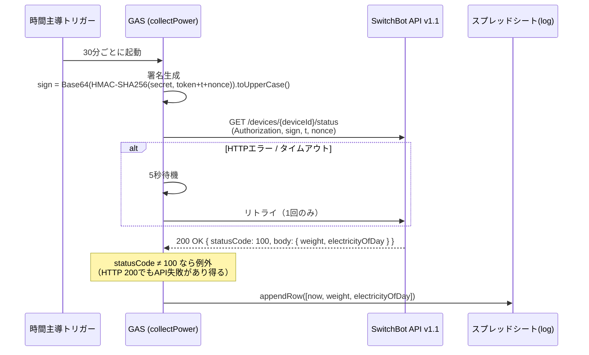
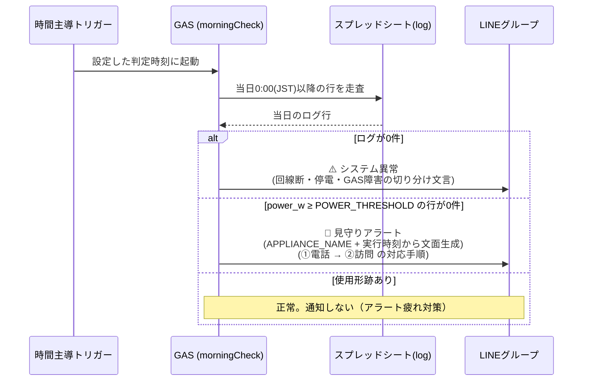
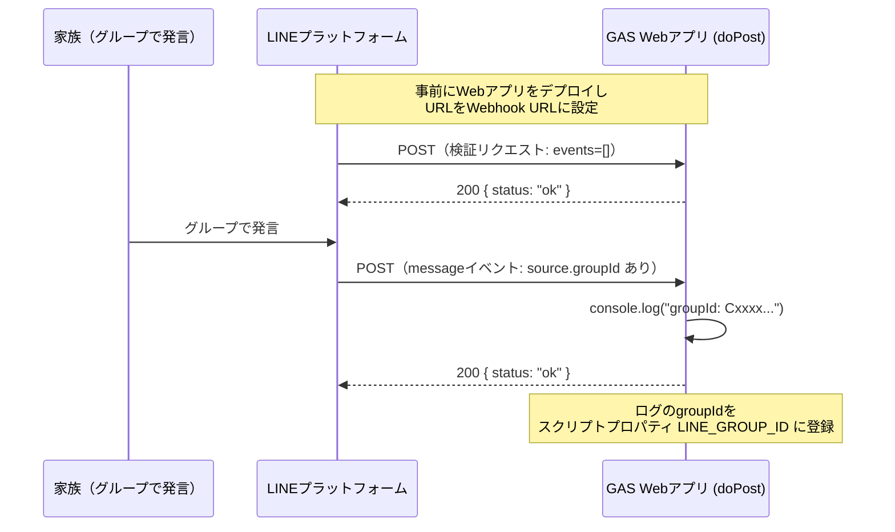

# アーキテクチャ

## 全体構成

## 定期ジョブ

| 関数 | トリガー | 役割 |
|---|---|---|
| `collectPower` | 30分ごと（短時間稼働の家電なら10分ごと） | プラグの電力値を取得し `log` シートへ追記 |
| `morningCheck` | 毎日 朝（観察期間のログから決定。初期値 10〜11時） | 当日0:00以降のログで生存判定。異常時のみLINE通知 |
| `weeklySummary` | 日曜 20〜21時 | 週次サマリーを1通送信し、30日超の古いログを削除 |

観察期間中は `collectPower` のみを登録し、しきい値と判定時刻を実測で決めたうえで残り2件を追加する（[README](../README.md#観察期間--しきい値と判定時刻を実測で決める) 参照）。

## シーケンス: 電力記録（collectPower・30分ごと）

## シーケンス: 朝の生存判定（morningCheck・毎朝）

## シーケンス: groupId取得（初回セットアップ時のみ）

## エラーハンドリング方針

- **SwitchBot API**: HTTPエラー・タイムアウトは5秒間隔で1回だけリトライ。HTTP 200でもボディの `statusCode` が 100 以外なら失敗として例外を投げる。
- **各ジョブ**: 全体を try/catch で囲み、想定外エラーはエラー概要をLINEに通知する。
- **LINE送信自体の失敗**: 通知ループを避けるため例外にせず、実行ログに残すのみ（`muteHttpExceptions: true` + try/catch）。
- **設定不備**: `validateConfig_()` が不足しているスクリプトプロパティ名を列挙して例外を投げるため、セットアップ漏れが実行ログから即座に分かる。`POWER_THRESHOLD` は必須プロパティとして扱い、値が正の数でない場合も例外にする。

## しきい値と判定時刻の決定方針

`POWER_THRESHOLD` と `morningCheck` の判定時刻は、コード側にもドキュメント側にも「推奨値」を持たせない設計にしている。この2つは見守り対象の家電と本人の生活パターンに完全に依存し、汎用的な正解が存在しないためである。

そのため `POWER_THRESHOLD` はデフォルト値を持たない必須プロパティとした。既定値があると「設定しなくても動く」と誤読され、本人の生活に合っていないしきい値のまま静かに稼働し続けてしまう。未設定なら `collectPower` を含む全ジョブが起動直後に例外で止まり、セットアップ漏れが必ず表面化する。

判定時刻はトリガー設定のみで決まる。見守りアラートの文面に含める時間帯表記は実行時刻（`Utilities.formatDate`）から生成するため、トリガー時刻を変更してもコードは修正不要。

対象家電の名称は `APPLIANCE_NAME`（任意、省略時 `家電`）で通知文に差し込む。家電を差し替えてもコード変更が不要な構成にしている。

## データ保持

`log` シートは30日分のみ保持し、`weeklySummary` 実行時に30日より古い行を先頭から削除する。判定に必要なのは当日分（morningCheck）と直近7日分（weeklySummary）のみなので、30日あれば障害調査にも十分な余裕がある。
