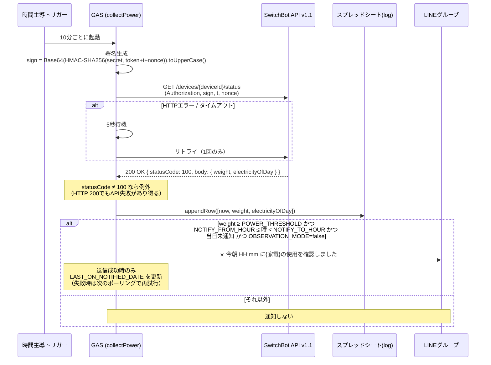
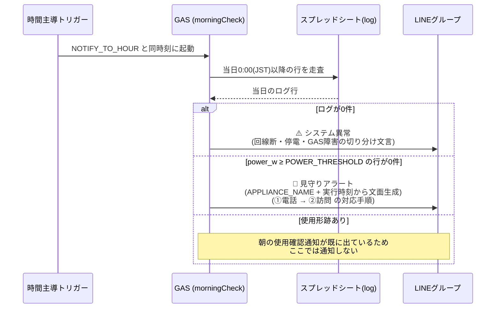
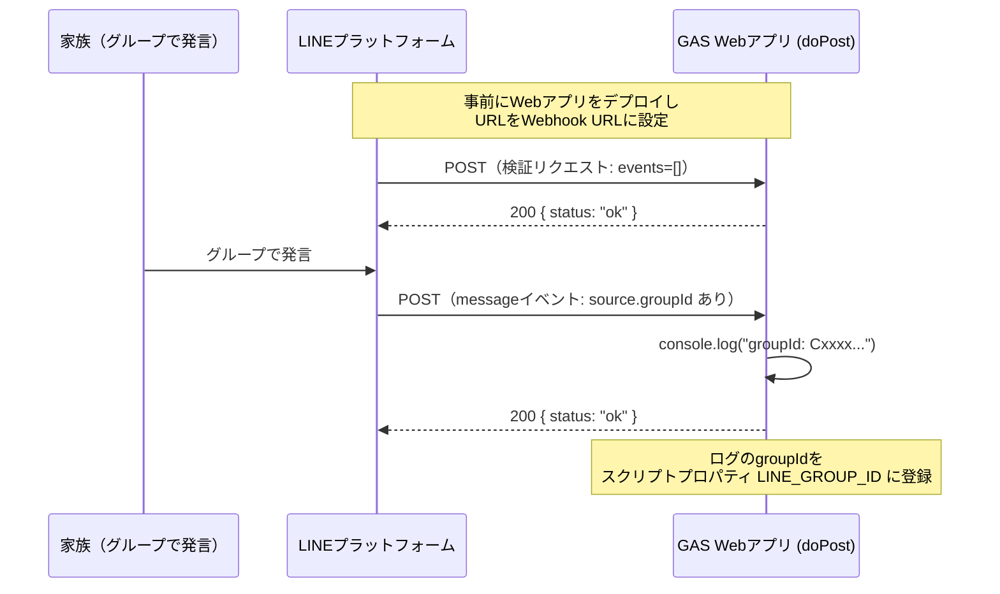

# アーキテクチャ

## 全体構成

## 定期ジョブ

| 関数 | トリガー | 役割 |
|---|---|---|
| `collectPower` | 10分ごと | プラグの電力値を取得し `log` シートへ追記。朝の時間帯に初めて使用を確認したら家族へ1通通知（**本命の通知**） |
| `morningCheck` | 毎日 `NOTIFY_TO_HOUR` と同時刻（観察期間のログから決定。初期値 10〜11時） | 当日0:00以降のログを走査し、使用が確認できなければアラート（**セーフティネット**） |
| `weeklySummary` | 日曜 20〜21時 | 週次サマリーを1通送信し、30日超の古いログを削除 |

観察期間中は `OBSERVATION_MODE=true` を設定し、`collectPower` のみを登録する。しきい値と通知時間帯を実測で決めたうえでフラグを外し、残り2件を追加する（[README](../README.md#観察期間--しきい値と判定時刻を実測で決める) 参照）。

## 通知の設計

ハートビート型（通知＝正常）とデッドマンスイッチ型（沈黙＝正常）を組み合わせている。

| # | 通知 | 役割 | 出るタイミング |
|---|---|---|---|
| 1 | 朝の使用確認 | 本命 | `collectPower` が朝の時間帯に初めてしきい値超えを観測したとき（1日1通） |
| 2 | 見守りアラート | セーフティネット | `morningCheck` の時点で当日の使用形跡がないとき |
| 3 | システム異常 | 死活監視 | `morningCheck` の時点で当日のログが0件のとき |
| 4 | 週次サマリー | 死活監視 | 日曜20時 |

1だけでは「毎朝の通知が来ないことに家族が気づけない」ため、2で補っている。逆に2だけ（デッドマンスイッチ単独）では、家電を使わない日に必ず誤報が出る。両者を併用することで、誤報を抑えながら見落としも防ぐ設計にしている。

### 通知モード

上表は本運用時の挙動である。セットアップ中は2つのフラグで通知の挙動を切り替える。

| 段階 | フラグ | 通知 | 判定に使う関数 |
|---|---|---|---|
| 観察期間 | `OBSERVATION_MODE=true` | なし | （通知しない） |
| 試作運用 | `TRIAL_MODE=true` | ON/OFFの変化を都度 | `notifyStateChangeIfNeeded_` |
| 本運用 | どちらもなし | 上表の4種類 | `notifyFirstUseIfNeeded_` |

分岐は `notifyPowerIfNeeded_` に集約し、`OBSERVATION_MODE` を優先する（通知を完全に止めたい状態が最も強い意図であるため）。`morningCheck` / `weeklySummary` はどちらかのフラグが立っていれば何もしない。

試作運用を設けているのは、**しきい値が決まっても本運用の判定が成立するとは限らない**ためである。対象家電が夜通しつけっぱなしになっていると、朝の初回検知が「本人が起きた」ことを意味しない。ON/OFFを都度通知すれば、OFF通知が来ないことでつけっぱなしを検出できる。

### 状態記録の方針が2つで逆になっている理由

| 通知 | 記録するタイミング | 理由 |
|---|---|---|
| 朝の使用確認（`LAST_ON_NOTIFIED_DATE`） | **送信成功時のみ** | 失敗した日の通知を次のポーリングで再試行したい。記録を先にすると、その日の通知が永久に失われる |
| 試作運用のON/OFF（`LAST_POWER_STATE`） | **送信の成否に関わらず** | 失敗した変化を再通知すると、実際とずれた時刻の通知が延々と続く |

前者は「その日の通知が届くこと」が重要で、後者は「変化の時刻が正しいこと」が重要という違いによる。

## シーケンス: 電力記録と朝の使用確認通知（collectPower・10分ごと）

朝の使用確認通知は「立ち上がりの検知」ではなく「**当日の通知時間帯に初めてしきい値を超えた観測**」で判定している。直前の行と比較する方式にしないのは、ログの欠測やポーリングの取りこぼしに影響されないようにするため。日付をまたいだ判定は `LAST_ON_NOTIFIED_DATE` の一致比較だけで済む。

## シーケンス: セーフティネット（morningCheck・毎朝）

## シーケンス: groupId取得（初回セットアップ時のみ）

## エラーハンドリング方針

- **SwitchBot API**: HTTPエラー・タイムアウトは5秒間隔で1回だけリトライ。HTTP 200でもボディの `statusCode` が 100 以外なら失敗として例外を投げる。
- **各ジョブ**: 全体を try/catch で囲み、想定外エラーはエラー概要をLINEに通知する。ただし**同じジョブのエラー通知は60分に1通まで**に間引く（`ERROR_NOTIFY_INTERVAL_MINUTES_`）。`collectPower` は10分ごとに動くため、SwitchBot APIの障害やプラグのオフラインが続くと1日144通が飛び、LINEの無料枠（月200通）を1日半で使い切って本来のアラートが送れなくなる。実行ログには毎回残すため、障害の全期間は追える。送信成功時のみ時刻を記録するので、LINE側が復旧したタイミングで1通は必ず届く。
- **LINE送信自体の失敗**: 通知ループを避けるため例外にせず、実行ログに残すのみ（`muteHttpExceptions: true` + try/catch）。
- **設定不備のエラーはLINEに届かない**: `pushLine_` も `getConfig_()` を呼ぶため、必須プロパティが欠けている状態ではエラー通知自体が送れず、実行ログにのみ残る。これが `setup.gs` の各関数が先に `getConfig_()` を呼んでいる理由でもある（セットアップ時点で気づけなければ、誰にも通知されないまま停止し続ける）。
- **設定不備**: `validateConfig_()` が不足しているスクリプトプロパティ名を列挙して例外を投げるため、セットアップ漏れが実行ログから即座に分かる。`POWER_THRESHOLD` は必須プロパティとして扱い、値が正の数でない場合も例外にする。

## しきい値と通知時間帯の決定方針

`POWER_THRESHOLD` と通知時間帯は、コード側にもドキュメント側にも「推奨値」を持たせない設計にしている。見守り対象の家電と本人の生活パターンに完全に依存し、汎用的な正解が存在しないためである。

そのため `POWER_THRESHOLD` はデフォルト値を持たない必須プロパティとした。既定値があると「設定しなくても動く」と誤読され、本人の生活に合っていないしきい値のまま静かに稼働し続けてしまう。未設定なら `collectPower` を含む全ジョブが起動直後に例外で止まり、セットアップ漏れが必ず表面化する。

`NOTIFY_FROM_HOUR` / `NOTIFY_TO_HOUR` には既定値（5〜11時）を持たせている。しきい値と違い、外れていても「通知が来ない」という安全側の失敗になり、`morningCheck` のアラートで拾えるためである。ただし観察期間のログから調整することを前提としている。

`morningCheck` の判定時刻はトリガー設定のみで決まる。`NOTIFY_TO_HOUR` と同じ時刻に揃える必要があり、ずれると「朝の通知も来ないがアラートも出ない」空白時間が生じる。見守りアラートの文面に含める時間帯表記は実行時刻（`Utilities.formatDate`）から生成するため、トリガー時刻を変更してもコードは修正不要。

対象家電の名称は `APPLIANCE_NAME`（任意、省略時 `家電`）で通知文に差し込む。家電を差し替えてもコード変更が不要な構成にしている。

## 観察期間の通知抑止

`collectPower` が朝の使用確認通知も担当するため、観察期間中にトリガーを登録すると暫定しきい値のまま通知が飛んでしまう。これを避けるため `OBSERVATION_MODE`（`true` のとき全通知を抑止）を用意している。3ジョブすべてが起動直後にこのフラグを確認する。

トリガーを登録しないことで通知を止める方式にはしていない。`collectPower` は観察期間中も回し続ける必要があるためである。

## デプロイとトリガー登録

コードの反映は `clasp push`、Webアプリの公開は `clasp deploy` で行う。Webアプリの実行ユーザーとアクセス権は `appsscript.json` の `webapp` セクション（`USER_DEPLOYING` / `ANYONE_ANONYMOUS`）で管理しており、エディタUIでの設定を不要にしている。

一方でトリガー登録は clasp では行えない。UIでの手作業に頼ると設定ミスが起きるため、`setup.gs` に登録用の関数を置き、エディタから手動実行する運用にしている。

| 関数 | 用途 |
|---|---|
| `setupObservationTriggers` | 観察期間用。`collectPower` のみ登録。`OBSERVATION_MODE` が `true` でなければ実行を拒否する |
| `setupTrialTriggers` | 試作運用用。`collectPower` のみ登録。`TRIAL_MODE` が `true` でなければ実行を拒否する |
| `setupTriggers` | 本運用用。3件を登録。`OBSERVATION_MODE` / `TRIAL_MODE` のいずれかが `true` なら実行を拒否する |
| `showTriggers` | 登録済みトリガーの一覧表示 |
| `deleteAllTriggers` | このプロジェクトのトリガーを全削除 |

この方式にしている理由は3つある。

1. **`morningCheck` の時刻を `NOTIFY_TO_HOUR` から導出できる** — 前述の「揃えないと空白時間が生じる」制約を、手作業ではなくコードで保証する
2. **フラグの付け外し忘れを構造的に防げる** — 各関数が対応するフラグの状態を検査して実行を拒否する
3. **設定不備をセットアップ時点で発見できる** — いずれも先に `getConfig_()` を呼ぶ。プロパティ不足を実行時に見つけると、`notifyJobError_` が10分ごとにLINE通知を送り続けてしまう

いずれの関数も既存トリガーを削除してから登録するため、何度実行しても重複しない。

## 設定値の再調整

`POWER_THRESHOLD` / `NOTIFY_FROM_HOUR` / `NOTIFY_TO_HOUR` と対象家電の選定は、その人のその時点の生活に紐づいた値であり、恒久的な設定ではない。季節による起床時刻の変化、生活リズムの変化（入院・同居家族の増減）、家電の買い替え、習慣の変化があれば再調整が必要になる。

そのため `OBSERVATION_MODE=true` に戻して `setupObservationTriggers` を実行すれば、通知を止めたままログを取り直せる構成にしている。セットアップは一方向の手順ではなく、いつでも観察期間に戻れる。

## データ保持

`log` シートは30日分のみ保持し、`weeklySummary` 実行時に30日より古い行を先頭から削除する。判定に必要なのは当日分（morningCheck）と直近7日分（weeklySummary）のみなので、30日あれば障害調査にも十分な余裕がある。

### 列の意味

| 列 | 内容 | 判定に使うか |
|---|---|---|
| `timestamp` | 記録時刻（JST） | ✓ |
| `power_w` | SwitchBot API の `weight`。現在の負荷電力（W） | ✓ |
| `electricity_of_day` | SwitchBot API の `electricityOfDay` の生値 | **使わない** |

`electricity_of_day` は**値の意味が特定できていない**ため、判定には一切使わず参考値として記録するだけにしている。実測で次の挙動を確認した。

- **日付をまたがずに減少（リセット）することがある** — 実測では 09:39 に `379` だった値が 10:09 に `50` へ落ちた
- **単位が特定できない** — 「分」とすると 10:09〜17:06 の間に経過時間417分に対して436増加しており、経過時間を超えるため成立しない。「kWh / Wh」とすると同時刻の `power_w`（平均約390W）と桁が合わない

当初この列は `daily_kwh` という名前で「当日累計電力量」として記録していたが、上記のとおり kWh である根拠がないため `electricity_of_day` に改名した。API のフィールド名をそのまま使い、単位についての主張をしない名前にしている。

**この列を根拠に判定を組んではいけない。** 短時間・高電力の家電（電気ポット等）の取りこぼしを積算値で解決する案は、この列が信頼できないため実現できていない。

> 既に運用中のシートは見出し行が `daily_kwh` のままだが、コードは列名ではなく列インデックスで読むため動作に影響はない。手で書き換えても構わない。
